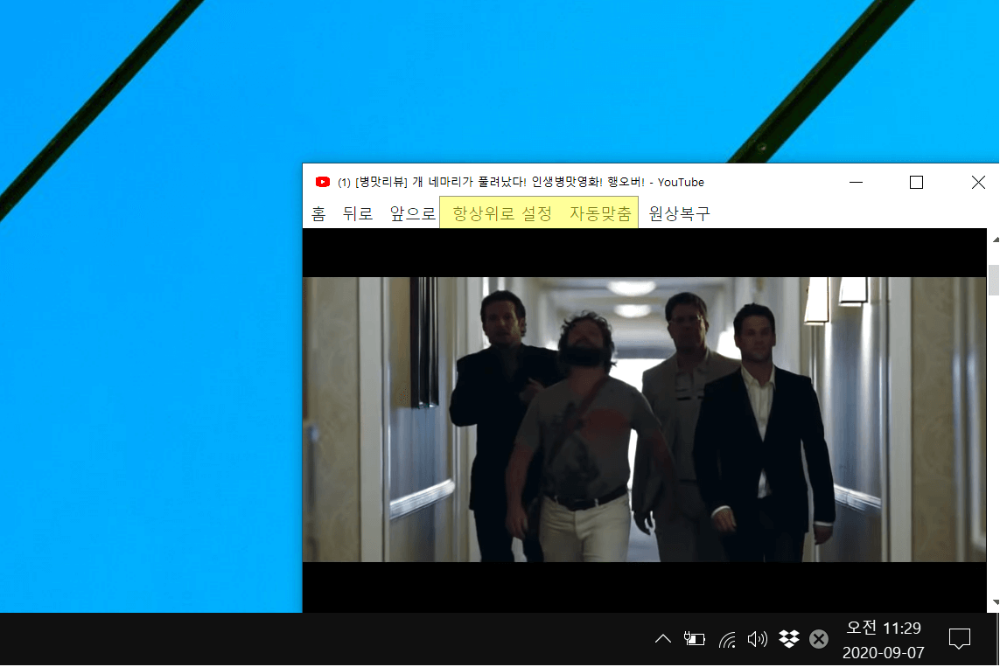

### 소개
작업하면서 구석에 놓고 시청할 수 있는 유튜브 플레이어


### 주요 기능
 - 항상 위로 (항상위호 설정/해제)
 - 사이즈 조절 (자동맞춤 → x1 또는 x2 선택)
 - 광고 스킵 메크로

### 참고사항
 - 16:9 비율로 자동조절 (영상이 3:2 등의 비율이라면 직접 조정)
 - `C:\Users\{사용자 이름}\AppData\Local\Programs\electron-youtube-player` 경로에 바로 설치
 - 윈도우용으로만 코딩
 - 맥용으로 빌드되나 메뉴 설정이 따로 필요
 - `제어판 > 프로그램 추가/제거`에서 제거 가능

### 설치파일 빌드 방법
```
yarn
yarn dist:win
```

### 설치파일 바로 다운로드
[다운로드](https://github.com/JoonDong2/electron-youtube-player/raw/master/dist/electron-youtube-player%20Setup%200.1.6.exe)